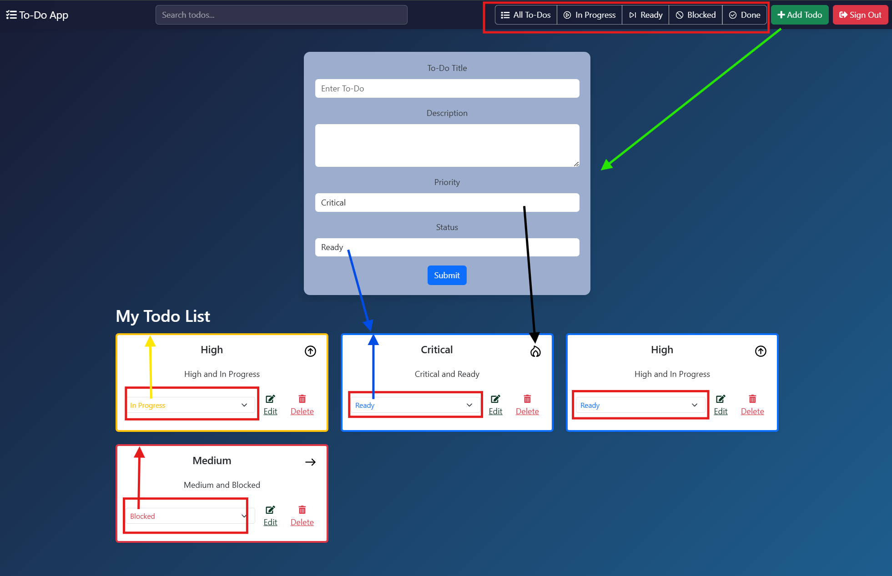

# Todo Application

A dynamic, responsive Todo management application built with vanilla JavaScript and Firebase, featuring real-time updates, priority management, and status tracking.



## Features

### Task Management
- **Create Tasks**: Add new todos with title, description, priority level, and status
- **Update Tasks**: Edit existing todos with real-time updates
- **Delete Tasks**: Remove todos with confirmation dialog
- **Priority Levels**: 
  - Critical
  - High
  - Medium
  - Low
  - Trivial

- **Status**: 
  - Ready 
  - In Progress
  - Blocked
  - Done

### Filtering & Organization
- Filter todos by status
- Search functionality across titles and descriptions
- Automatic sorting by priority level
- Visual status indicators with color-coded borders

```javascript
// Priority order: critical → high → medium → low → trivial
const priorityOrder = {
  critical: 0,
  high: 1,
  medium: 2,
  low: 3,
  trivial: 4
};

// Status order: In Progress → Ready → Blocked → Done
const statusOrder = {
  InProgress: 0,
  Ready: 1,
  Blocked: 2,
  Done: 3
};
```

### User Interface
- Clean, modern design with smooth animations
- Responsive layout supporting multiple screen sizes
- Interactive hover effects and visual feedback
- Glassmorphism design elements

## Technical Implementation

### Core Technologies
- Vanilla JavaScript (ES6+)
- Firebase Realtime Database
- Bootstrap 5
- SCSS
- Webpack

### Key Components

#### TodoCard.js
```javascript
// Handles individual todo item display
// Features:
// - Priority indicators
// - Status management
// - Edit/Delete functionality
```

#### TodoForm.js
```javascript
// Manages todo creation/editing
// Features:
// - Form validation
// - Dynamic updates
// - Status selection
```

#### NavBar.js
```javascript
// Navigation and filtering interface
// Features:
// - Search functionality
// - Status filtering
// - Authentication controls
```

### Event Handling

#### domEvents.js
```javascript
// Manages DOM interactions
// - Todo CRUD operations
// - Status updates
// - Form toggling
```

#### navEvents.js
```javascript
// Handles navigation events
// - Search filtering
// - Status filtering
// - Real-time updates
```

## Setup & Installation

1. Clone the repository
```bash
git clone https://github.com/omerakben/you-do.git
```

2. Install dependencies
```bash
npm install
```

3. Configure Firebase
- Create a `.env` file in the root directory (template is `.example.env` )
- Add your Firebase configuration:
```env
APP_API_KEY="your-api-key"
APP_AUTH_DOMAIN="your-auth-domain"
APP_DATABASE_URL="your-database-url"
APP_PROJECT_ID="your-project-id"
APP_STORAGE_BUCKET="your-storage-bucket"
APP_APP_ID="your-app-id"
APP_MEASUREMENT_ID="your-measurement-id"
```

1. Start the development server
```bash
npm start
```

## Usage Examples

### Creating a Todo
1. Click "+ Add Todo" button
2. Fill in the title and description
3. Select priority level
4. Choose initial status
5. Submit form

### Managing Todos
- **Change Status**: Use dropdown in todo card
- **Edit Todo**: Click the edit button and modify the form
- **Delete Todo**: Click delete button with confirmation
- **Filter Todos**: Use navbar status buttons
- **Search**: Type in the search bar for real-time filtering

## Contributing

1. Fork the repository
2. Create your feature branch (`git checkout -b feature/AmazingFeature`)
3. Commit your changes (`git commit -m 'Add some AmazingFeature'`)
4. Push to the branch (`git push origin feature/AmazingFeature`)
5. Open a Pull Request

## Contact

Omer (Ozzy) Akben - [E-Mail](mailto:akbenof@gmail.com)

## Links:

Project Link: [Github](https://github.com/omerakben/you-do)

SVG Link : [SVG](https://www.svgrepo.com/collection/wolf-kit-rounded-line-icons/)

Deployed URL: [Netlify](https://todo-e29.netlify.app/)
